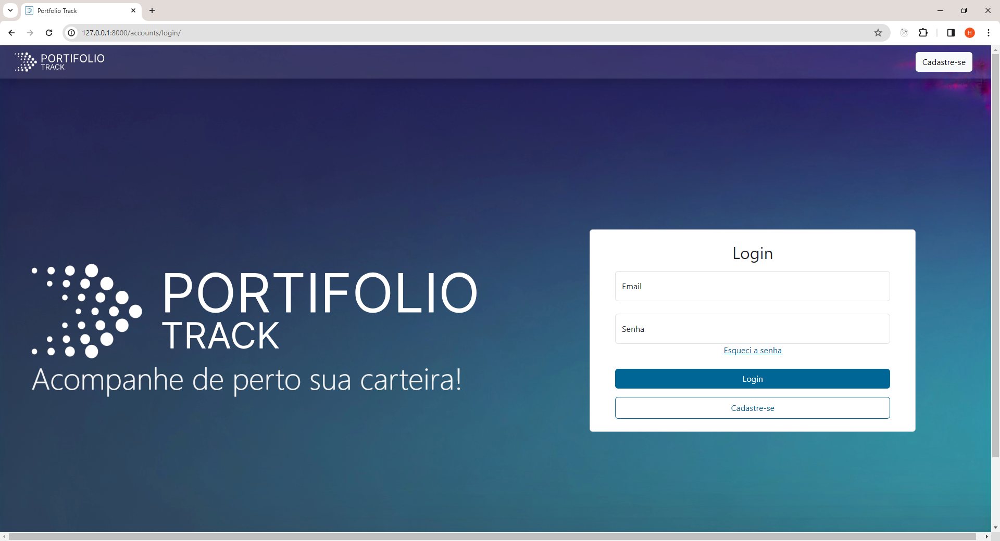
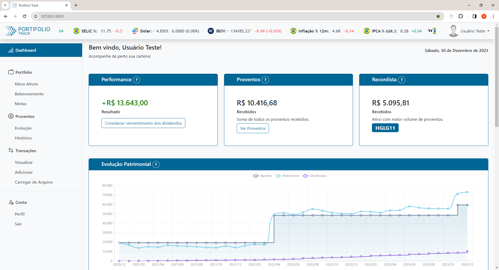
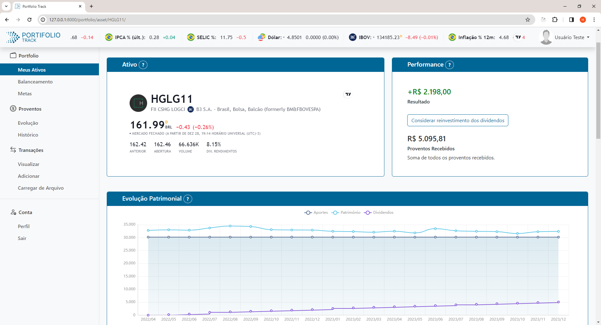
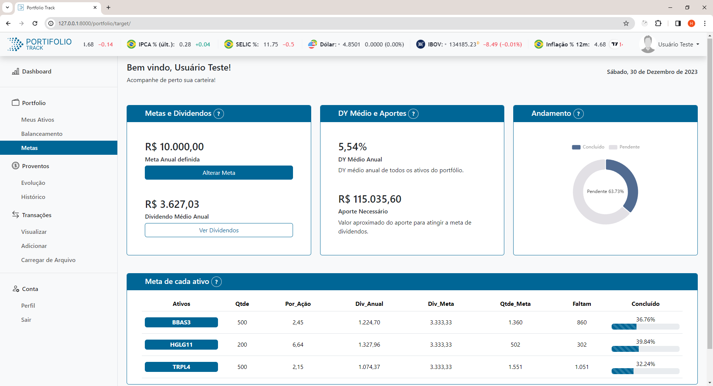

# Portfolio Track

O Portfolio Track é uma aplicação web desenvolvida em Django, projetada para fornecer uma plataforma eficiente para o acompanhamento detalhado de portfólios de investimentos financeiros.

## Funcionalidades Principais

### Acompanhamento de Transações

- Insira transações facilmente e deixe a aplicação buscar automaticamente dados do ativo usando a biblioteca `yfinance`.
- Calcule o preço médio do ativo automaticamente.

### Análise de Desempenho

- Visualize o desempenho do seu portfólio por meio de gráficos intuitivos.
- Acompanhe o histórico de aportes, evolução do patrimônio e recebimento de dividendos.

### Controle de Balanceamento

- Defina pesos para cada ativo e deixe a aplicação calcular a porcentagem ideal.
- Saiba quanto falta para atingir a porcentagem desejada.

### Meta de Dividendos

- Estabeleça metas anuais de dividendos.
- A aplicação calcula automaticamente o progresso em direção à meta, a quantidade total de aportes faltantes e distribuição por ativo.

### Recursos Adicionais

- Implementação segura de login com confirmação por e-mail.
- Total responsividade para diferentes tamanhos de tela.
- Consulta eficiente de dados usando um worker dedicado com Celery e Redis.
- Sistema de cache para otimização de desempenho.

## Como Iniciar

1. Clone o repositório.
2. Configure as variáveis de ambiente necessárias.
3. Instale as dependências usando `pip install -r requirements.txt`.
4. Execute as migrações do banco de dados: `python manage.py migrate`.
5. Inicie a aplicação: `python manage.py runserver`.

## Contribuição

- Faça um fork do projeto.
- Crie uma branch para sua contribuição: `git checkout -b feature-nova`.
- Faça commit das suas mudanças: `git commit -m 'Adiciona nova feature'`.
- Faça push para a branch: `git push origin feature-nova`.
- Abra um pull request.

## Contato

Para sugestões, dúvidas ou problemas, entre em contato pelo helio.card@yahoo.com.br

## Licença

Este projeto está licenciado sob a MIT - consulte o arquivo LICENSE.md para mais detalhes.

## Telas

### Login

*Login.*
<!-- Space -->

### Dashboard

*Dashboard.*

<!-- Space -->

### Meus Ativos

*Meus Ativos.*

<!-- Space -->

### Metas

*Metas.*
